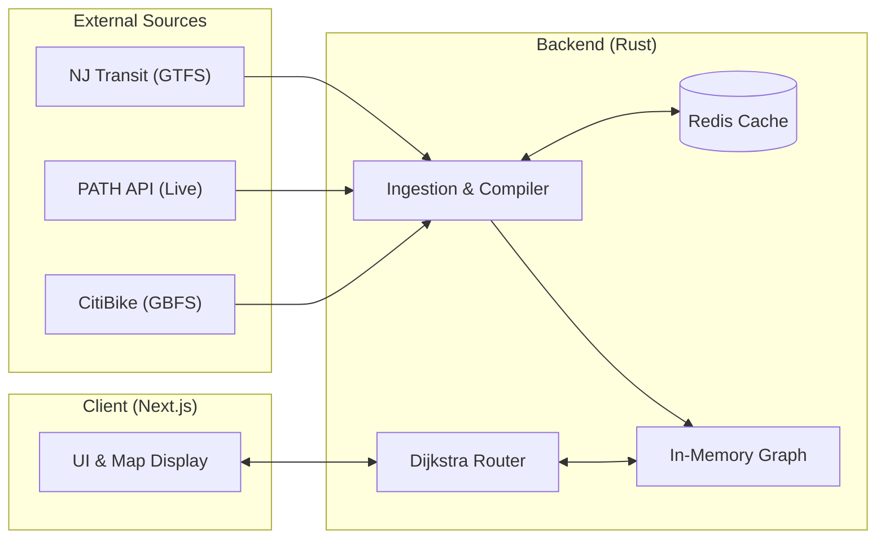

## NightOwl: Navigation Compiler 

This project aims to solve the simple question: what's the most efficient way to get from my home to work across different transportation options.

## System Architecture

This diagram visualizes how raw transit schedules and live streams are compiled into an optimized, in-memory graph.

## Project Roadmap

Here is the step-by-step implementation plan for **NightOwl**:

### Part 1: The Static Walking Skeleton ($G_{\text{static}}$)
- [ ] Set up baseline Rust workspace and graph primitives
- [ ] Formulate basic routing structures for a static walking graph
- [ ] Run baseline Dijkstra pathfinding test cases

### Part 2: The Schedule Compiler (Static GTFS)
- [ ] Parse routes, calendar dates, and travel schedules from GTFS zip feeds
- [ ] Compile schedules into time-expanded coordinate graph nodes
- [x] Handle transit transfers and walking buffers between hubs

### Part 3: The Live Stream (GBFS & Live PATH API Ingestion)
- [/] Pull real-time train coordinates and CitiBike dock statuses (GBFS)
- [ ] Incorporate delay offsets and vehicle positions dynamically into active travel edges

### Part 4: The Multi-Modal State Machine
- [ ] Support transitions between walking, biking, and transit modalities
- [ ] Enforce travel constraints (e.g. bike rules, waiting buffers)

### Part 5: The Interface & Delivery Pipeline
- [ ] Build the Next.js frontend map interface with Leaflet.js
- [ ] Deploy compiler logic and routing endpoints via low-latency API

