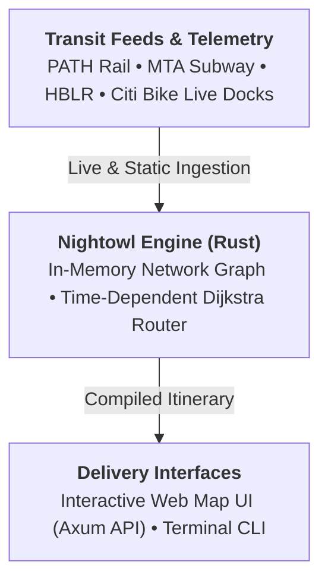
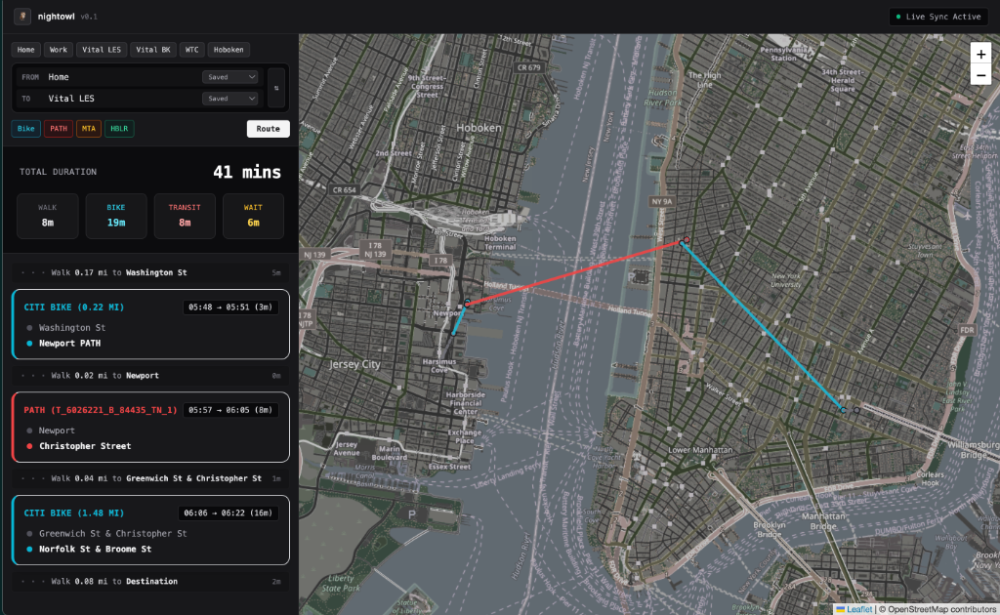

## NightOwl: Navigation Compiler 

Don't reinvent the wheel they said, ok I'll reinvent Google Maps. Really fun project; the actual pain point solved was supporting realtime hybrid multi-modal trips (eg. getting off MTA and taking CitiBike) and micromobility support (CitiBike docks availability).

NightOwl is a multi-modal, time-dependent urban navigation engine written in Rust that compiles schedules and live telemetry across PATH Rail, MTA Subway, Hudson-Bergen Light Rail (HBLR), and Citi Bike.

## System Architecture


```mermaid
flowchart TD
    Feeds["<b>Transit Feeds & Telemetry</b><br/>PATH Rail • MTA Subway • HBLR • Citi Bike Live Docks"]
    
    Engine["<b>Nightowl Engine (Rust)</b><br/>In-Memory Network Graph • Time-Dependent Dijkstra Router"]
    
    Clients["<b>Delivery Interfaces</b><br/>Interactive Web Map UI (Axum API) • Terminal CLI"]

    Feeds -->|Live & Static Ingestion| Engine
    Engine -->|Compiled Itinerary| Clients
```

## Project Roadmap

### Stage 1: Core Engine & Spatial Primitives
- [x] Set up Rust workspace and Dijkstra pathfinding primitives
- [x] Implement Manhattan grid distance ($L_1$ norm) and urban walking pace (2.5 mph)
- [x] Formulate initial time-dependent search states

### Stage 2: PATH Rail & Multi-Modal Routing Engine
- [x] Parse PATH GTFS static feeds (`stops.txt`, `stop_times.txt`)
- [x] Construct self-contained `Location` architecture (`Station` vs `Point`)
- [x] Implement multi-modal Dijkstra search: `Walk` $\rightarrow$ `Transit` $\rightarrow$ `Walk`
- [x] Verify coordinate-to-coordinate routing output against real-world Google Maps queries

### Stage 3: Micro-Mobility & Real-Time Streams (Citi Bike GBFS & Live Feeds)
- [x] Ingest Citi Bike GBFS live feeds (`station_status.json` with live available bikes & open dock slots)
- [x] Enforce real-time unlock/dock availability constraints in pathfinding (`can_unlock`, `can_dock`)
- [x] Live PATH real-time train departure integration (RidePATH feed with seconds-to-arrival overlay)
- [x] Authenticated NJ Transit Developer Token API manager with cached session tokens

### Stage 4: Multi-Agency Expansion (MTA Subway & Hudson-Bergen Light Rail)
- [x] Ingest full NYC MTA Subway static GTFS schedule (490+ stations across NYC)
- [x] Ingest Hudson-Bergen Light Rail (HBLR) & NJ Transit Rail via GTFS API with `calendar_dates.txt` support
- [x] Support cross-agency underground transfers (e.g. PATH 33rd St $\leftrightarrow$ MTA 34th St-Herald Sq)
- [x] Granular transportation mode toggles (`TransitMode` / `ModeSet`) with zero-cost Dijkstra filtering
- [x] CLI flags for selective modal routing (`--no-bike`, `--no-mta`, `--no-path`, `--no-hblr`, `--modes ...`)

```text
Loading networks...
Networks ready: 681 transit stations (674 graph nodes, 64 services), 2508 Citi Bike docks
Active modes:   walk, bike, path, mta, hblr
Real-time sync:
  [OK] Citi Bike: synced 2508 live docks
  [OK] PATH: synced 31 live departures
  [OK] NJ Transit: authenticated user 'shivabalanb'
====================================================================
ROUTE: Point (40.7220, -74.0369) -> Point (40.7172, -73.9864)
Date:  2026-08-28 (Friday) | Dep: 00:47 EST | Arr: 01:18 EST | Duration: 31 mins
====================================================================
Leg 1: [Walk to Bike Dock (0.17 mi, 5 mins)]
  Start:   Point (40.7220, -74.0369)                @ 00:47 EST
  End:     Washington St (Citi Bike)                @ 00:52 EST
--------------------------------------------------------------------
Leg 2: [Bike (0.22 mi, 3 mins)]
  Unlock:  Washington St (Citi Bike)                @ 00:52 EST
  Dock:    Newport PATH (Citi Bike)                 @ 00:55 EST
--------------------------------------------------------------------
Leg 3: [Walk to Station (0.02 mi, 0 mins)]
  Start:   Newport PATH (Citi Bike)                 @ 00:55 EST
  End:     Newport (PATH)                           @ 00:55 EST
--------------------------------------------------------------------
  Wait 2 mins at Newport (PATH)
--------------------------------------------------------------------
Leg 4: [Transit (live_NEW_33S) - 5 mins, 1 stop]
  Board:   Newport (PATH)                           @ 00:57 EST
  Alight:  33rd Street (PATH)                       @ 01:02 EST
--------------------------------------------------------------------
Leg 5: [Walk (0.05 mi, 1 mins)]
  Start:   33rd Street (PATH)                       @ 01:02 EST
  End:     34 St-Herald Sq (MTA Subway)             @ 01:03 EST
--------------------------------------------------------------------
  Wait 2 mins at 34 St-Herald Sq (MTA Subway)
--------------------------------------------------------------------
Leg 6: [Transit (BSP26GEN-D085-Weekday-00_002550_D..S05R) - 7 mins, 3 stops]
  Board:   34 St-Herald Sq (MTA Subway)             @ 01:05 EST
  Alight:  Grand St (MTA Subway)                    @ 01:12 EST
--------------------------------------------------------------------
Leg 7: [Walk to Bike Dock (0.04 mi, 1 mins)]
  Start:   Grand St (MTA Subway)                    @ 01:12 EST
  End:     Forsyth St & Grand St (Citi Bike)        @ 01:13 EST
--------------------------------------------------------------------
Leg 8: [Bike (0.27 mi, 3 mins)]
  Unlock:  Forsyth St & Grand St (Citi Bike)        @ 01:13 EST
  Dock:    Norfolk St & Broome St (Citi Bike)       @ 01:16 EST
--------------------------------------------------------------------
Leg 9: [Walk to Destination (0.08 mi, 2 mins)]
  Start:   Norfolk St & Broome St (Citi Bike)       @ 01:16 EST
  End:     Point (40.7172, -73.9864)                @ 01:18 EST
====================================================================
```

### Stage 5: Web UI & Delivery Pipeline (Axum REST API & Leaflet UI)
- [x] Build high-performance Rust web API endpoint (`GET /api/route?origin=...&destination=...`)
- [x] Integrate OpenStreetMap Geocoding API + Built-in NYC/NJ address book
- [x] Create embedded minimalist interactive map frontend with Leaflet.js
- [x] Render multi-modal route step polylines on the map (Citi Bike, PATH, MTA Subway, HBLR, Walk)
- [x] Containerize with multi-stage Docker for one-click cloud deployment

## Web Server & UI

* **Live Cloud Deployment**: **[https://nightowl-kxyk.onrender.com](https://nightowl-kxyk.onrender.com)**

To start the local REST API and interactive web map:

```bash
cargo run
```

Open **`http://localhost:3000`** in your browser.

## CLI Usage

```bash
# Default: run CLI routing with all transportation modes
cargo run --release

# Disable specific modes:
cargo run --release -- --no-bike
cargo run --release -- --no-mta
cargo run --release -- --no-path
cargo run --release -- --no-hblr

# Restrict to specific modes:
cargo run --release -- --modes walk,path,mta
```

## Docker Deployment (Free Hosting)

Build and run locally:
```bash
docker build -t nightowl .
docker run -p 3000:3000 nightowl
```
---

## Live Interface Preview




