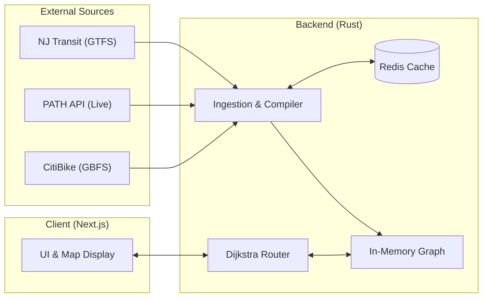

## NightOwl: Navigation Compiler 

This project aims to solve the simple question: what's the most efficient way to get from my home to work across different transportation options.

## System Architecture

This diagram visualizes how raw transit schedules and live streams are compiled into an optimized, in-memory graph.


```mermaid
graph LR
    subgraph External ["External Sources"]
        NJT["NJ Transit (GTFS)"]
        PATH["PATH API (Live)"]
        CB["CitiBike (GBFS)"]
    end

    subgraph Backend ["Backend (Rust)"]
        ING["Ingestion & Compiler"]
        REDIS[("Redis Cache")]
        GRAPH["In-Memory Graph"]
        ROUTE["Dijkstra Router"]
        
        ING <--> REDIS
        ING --> GRAPH
        ROUTE <--> GRAPH
    end

    subgraph Client ["Client (Next.js)"]
        UI["UI & Map Display"]
    end

    NJT & PATH & CB --> ING
    UI <--> ROUTE
```

## Project Roadmap

Here is the step-by-step implementation plan for **NightOwl**:

### Stage 1: The Static Walking Skeleton ($G_{\text{static}}$)
- [x] Set up baseline Rust workspace and graph primitives
- [x] Formulate basic routing structures for a static walking graph
- [x] Run baseline Dijkstra pathfinding test cases
```
Edge: Newport PATH <-> Grove St PATH (0.6711 miles)
Edge: Grove St PATH <-> Exchange Place PATH (0.5788 miles)
Edge: Newport PATH <-> Exchange Place PATH (0.7366 miles)

SUCCESS: Shortest path distance from Newport PATH to Exchange Place PATH is 0
.7366 miles!

--- Testing Edge Weight At Specific Departure Times ---
Arriving at 8:00 AM (480 mins): 1.53 minutes total cost
Arriving at 8:10 AM (490 mins): 21.53 minutes total cost
Arriving at 9:00 AM (540 mins): inf minutes total cost
-------------------------------------------------------
```

### Stage 2: The Schedule Compiler (Static GTFS)
- [ ] Parse routes, calendar dates, and travel schedules from GTFS zip feeds
- [ ] Compile schedules into time-expanded coordinate graph nodes
- [ ] Handle transit transfers and walking buffers between hubs
```
loaded 64 stations!

station: 14th Street (26722) at (40.7373, -73.9968)
station: 23rd Street (26723) at (40.7429, -73.9928)
station: 33rd Street (26724) at (40.7491, -73.9883)
station: 9th Street (26725) at (40.7342, -73.9991)
station: Christopher Street (26726) at (40.7330, -74.0071)
station: Exchange Place (26727) at (40.7168, -74.0324)
station: Grove Street (26728) at (40.7197, -74.0425)
station: Harrison (26729) at (40.7394, -74.1559)
station: Hoboken (26730) at (40.7359, -74.0292)
station: Journal Square (26731) at (40.7330, -74.0629)

loaded 153927 scheduled stop_times!
```

### Stage 3: The Live Stream (GBFS & Live PATH API Ingestion)
- [ ] Pull real-time train coordinates and CitiBike dock statuses (GBFS)
- [ ] Incorporate delay offsets and vehicle positions dynamically into active travel edges

### Stage 4: The Multi-Modal State Machine
- [ ] Support transitions between walking, biking, and transit modalities
- [ ] Enforce travel constraints (e.g. bike rules, waiting buffers)

### Stage 5: The Interface & Delivery Pipeline
- [ ] Build the Next.js frontend map interface with Leaflet.js
- [ ] Deploy compiler logic and routing endpoints via low-latency API

